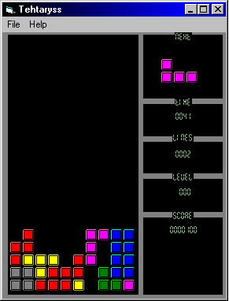



## \[A great tetris clone\]

### Description

hooooray another tetris clone! but this one is cool because i made it. it uses bitblt, classes, and a simple game loop. the code isn't too messy. i tried to comment some of it. try to learn from it. give me your feedback if you find bugs or anything, or if you like it or HATE IT! thanks
 
### More Info
 

             |
---                |---
**Submitted On**   |2004-03-29 19:53:34
**By**             |[john hollister](https://github.com/Planet-Source-Code/PSCIndex/blob/master/ByAuthor/john-hollister.md)
**Level**          |Intermediate
**User Rating**    |4.8 (29 globes from 6 users)
**Compatibility**  |VB 5\.0, VB 6\.0
**Category**       |[Games](https://github.com/Planet-Source-Code/PSCIndex/blob/master/ByCategory/games__1-38.md)
**World**          |[Visual Basic](https://github.com/Planet-Source-Code/PSCIndex/blob/master/ByWorld/visual-basic.md)
**Archive File**   |[\[A\_great\_t1726253292004\.zip](https://github.com/Planet-Source-Code/john-hollister-a-great-tetris-clone__1-52740/archive/master.zip)

